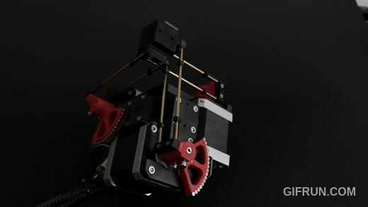
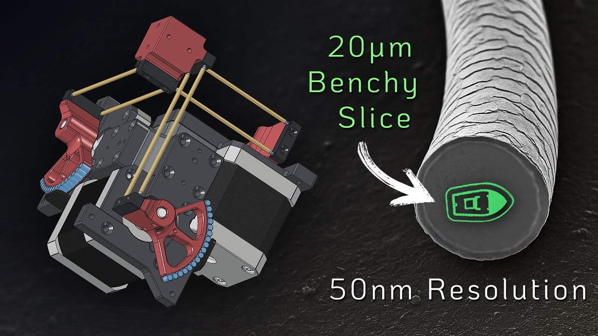

## Micro Manipulator Stepper

This project contains an open source low-cost, easy-to-build motorized **XYZ Micro-Manipulator** motion control platform achieving sub micrometer precision.
It's designed for applications such as optical alignment, probing electronic components, and microscopy.

Check out the YouTube video for more information about the device and how it is built:

Thanks to its parallel kinematic structure and miniature ball joints, it achieves good mechanical stiffness and a large range of motion.
The motors are off the shelf stepper motors dr​iven by a 30 kHz closed loop controller and a very precise PWM signal.
A 'magnetic gearing' approach increases the resolution of the low-cost magnetic rotary encoders by a factor of 30 allowing for steps down to 50nm
(**Please mind the difference between resolution and accuracy**. The absolute accuracy is much lower).

The device can be controlled via simple G-Code commands over a USB serial interface and is thus easily integrated into other projects.
The firmware implements a complete motion planning stack with look-ahead for smooth and accurate path following capabilities.

### ⚙ CAD-Files

All CAD models are made in **FreeCAD** to​ allow everyone to view and modify the design without subscribing or paying for a proprietary CAD solution.
Note that most components are already designed with the goal to make them easily machinable on a 3-Axis CNC-Mill.
You can also 3D-Print the parts but have to live with thermal drift (carbon filled filaments can reduce this problem).

    

 

The files can be found here: [CAD Models](construction).
Please note that FreeCAD version **1.1.0dev** was used, and the files might not work with older versions.

### ⚙ Kinematic Model

The kinematic model is defined here: [kinematic_model_delta3d.cpp](firmware/MotionControllerRP/src/kinemtaic_models/kinematic_model_delta3d.cpp).
Please check the dimensions of your build against the values set in the constructor. In particular, make sure the arm length matches.

### ⚙ Electronics

IMOPTRANT: If you fabricated the pcb with verion v1.2 (see version label on the board) you need to drill out a misplaced via on diode D1 that shorts 5V rail to ground. The problem was fixed in v1.3.

The electronics are designed in **KiCAD** and only commonly available modules (motor drivers and MCU boards) are used and connected by a simple PCB. No SMD soldering is required to populate the board to make the build extra accessible.
For usual winding resistance of your motors, the device should be powered by $${\color{lightgreen} 5V-6V }$$ to keep current and heating to a reasonable level.

  
  

### ⚙ Firmware

The firmware is written in C++ and takes some inspiration from the 'SimpleFOC' project. It aims to be streamlined and readable without any extra fuss, focusing on the hardware used in this project.
It implements path planning with look-ahead and, unlike many other motion controller projects, supports true 6DOF-Pose interpolation and planning, making it ready for driving hexapod motion platforms; that may or may not be the next step for this project.

You may find configuration for pin numbers, motor type, and other parameters in [hw_config.h](firmware/MotionControllerRP/src/hw_config.h). Please check them before uploading the firmware.

  
  

#### Building and Flashing the Firmware

For building and flashing the firmware, Visual Studio Code (available for free on Windows and Linux) is recommended.
Install the PlatformIO add-on and open the firmware folder. You can now build and flash the firmware like any other PlatformIO project.

### ⚙ G-Code Interface

The firmware supports only a small subset of G-Code commands listed below.  
Each command is acknowledged with either an **`ok`** or **`error`** response.  

If a command provides additional information (e.g., the *get position* command), that information is returned **before** the `ok` message.  
The client must wait for an acknowledgment from the previous command before sending the next one—otherwise, behavior is undefined.

| Command        | Description                                                                 |
|----------------|-----------------------------------------------------------------------------|
| `G0 X Y Z F`   | Move the end-effector in a straight line to the specified position.   • `X`: target position on X-axis   • `Y`: target position on Y-axis   • `Z`: target position on Z-axis   • `F`: feed rate (movement speed) |
| `G1 X Y Z F`   | Same as `G0`. |
| `M204 L A`     | Set current acceleration.   • `L`: linear acceleration (m/s²)   • `A`: angular acceleration (rad/s²) |
| `M50`          | Get current actuator pose (position).                                       |
| `M51`          | Get motion controller and servo loop update frequency.                     |
| `M52`          | Get the number of items in the planner queue.                               |
| `M53`          | Check if all moves are finished. Returns `1` if finished, `0` otherwise.    |

# Youtube Video

