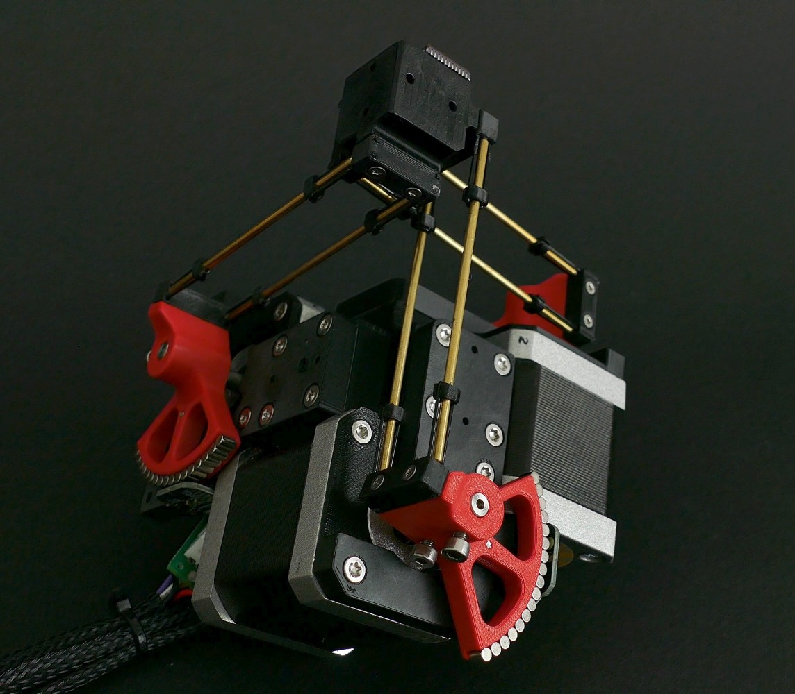
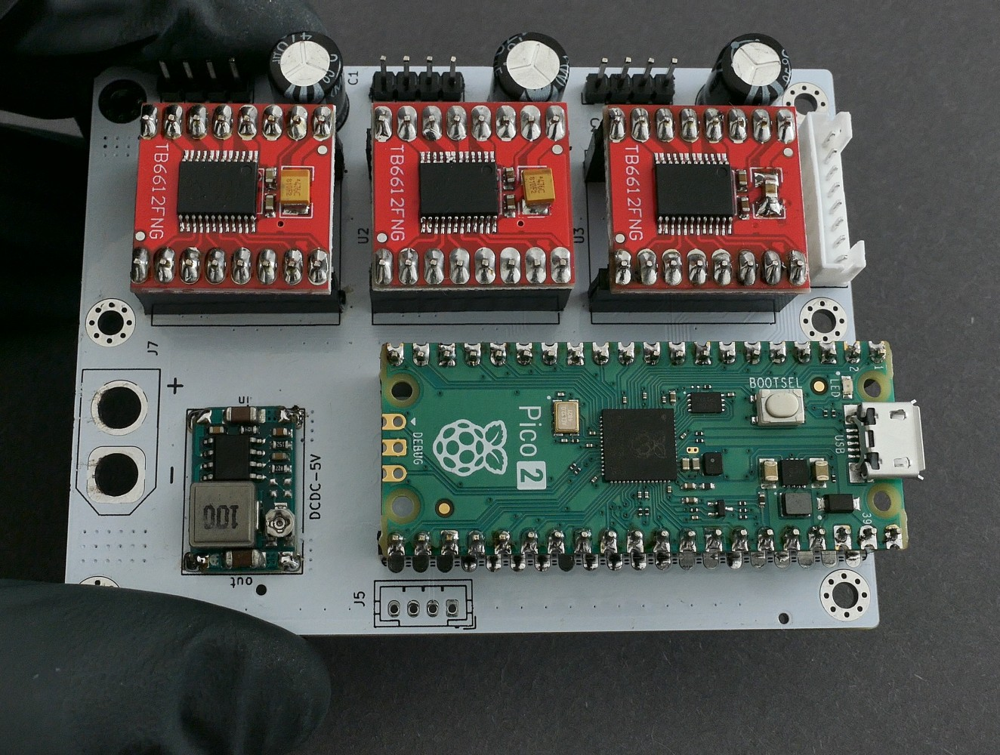
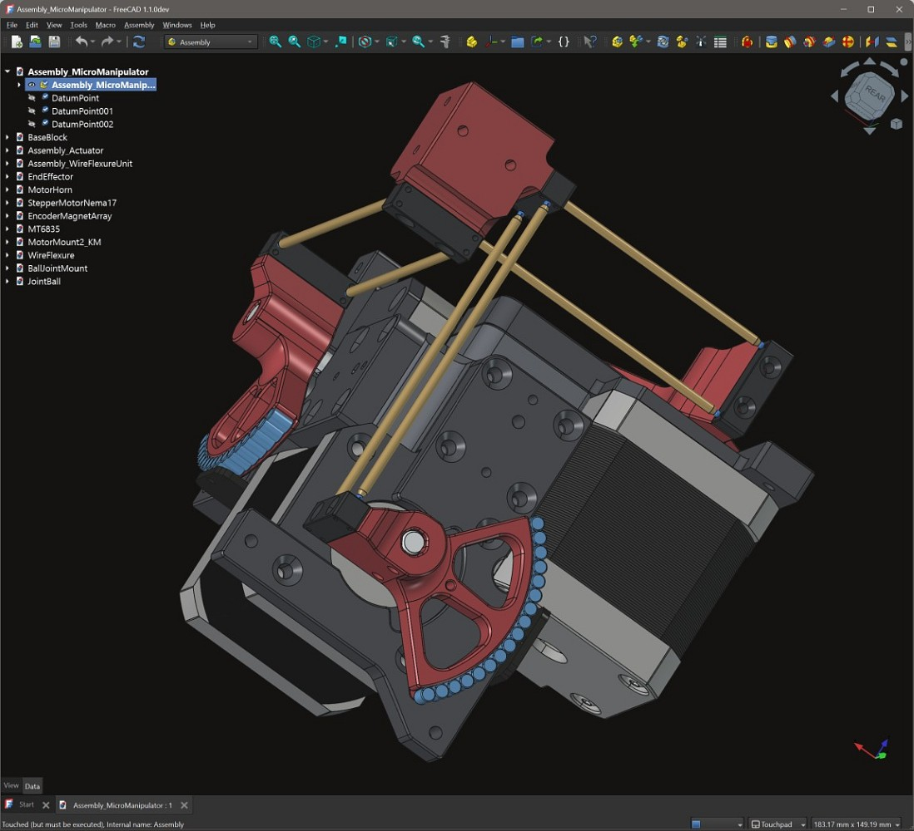
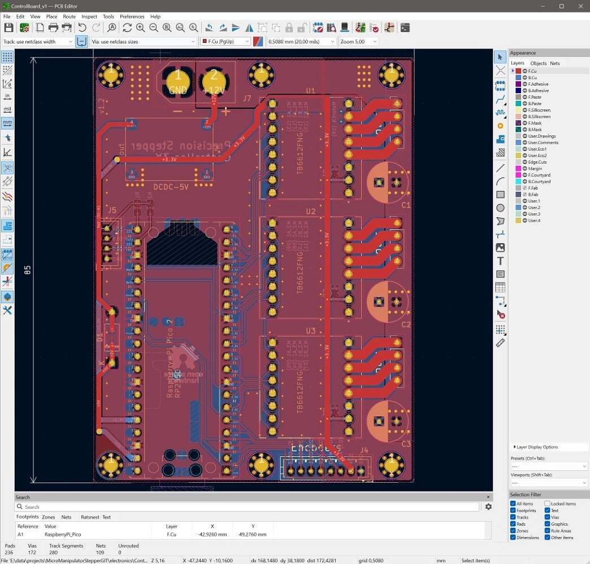
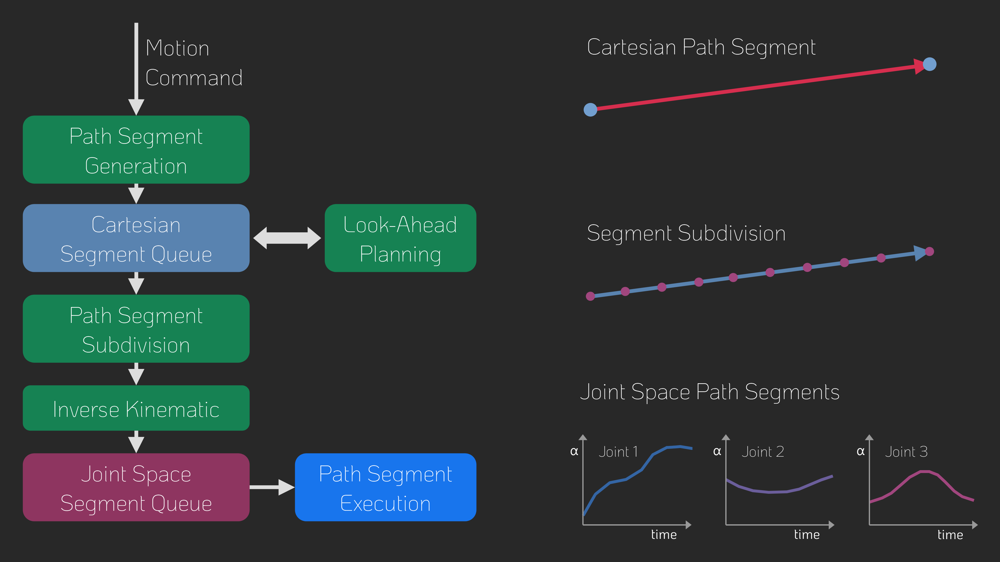

# Micro Manipulator Stepper (Page under construction)

This project contains an open source low-cost, easy-to-build motorized **XYZ Micro-Manipulator** motion controll platform achieving sub micrometer precision.
It's designed for applications such as optical alignment, probing electronic components, and microscopy.

Thanks to its parallel kinematic structure and miniature ball joints, it achieves good mechanical stiffness and a large range of motion.
The motors are off the shelf stepper motors driven by a 30kHz closed loop controller and a very precise PWM signal.
A 'magnetic gearing' approach increases the resolution of the low-cost megnetic rotary encoders by a factor of 30 allowing for steps down to 50nm
(**Please mind the difference beteween resolution and accuracy**. The absoluthe accuracy is much lower).

The device can be controlled via simple G-Code commands over an USB serial interface and is thus easily integrated into other projects.
The firmware implements a complete motion planning stack with look-ahead for smooth and accurate path following capabilities. 

  
  

### ⚙ CAD-Files

All CAD models are made in FreeCAD, to allow everyone to view and modify the design without subscribing or paying for a propriatary CAD solution.
Note that most components are already disgned with the goal to make them easily machinable on a 3-Axis CNC-Mill.
You can also 3D-Print the parts but have to live with thermal drift (carbon filled filaments cam reduce this problem).

    

 

The files can be found here: [CAD Models](construction).
Please note that FreeCAD version **1.1.0dev** was used and the files might not work with older versions.

### ⚙ Kinematic Model

The kinematic model is defined here: [kinematic_model_delta3d.cpp](firmware/MotionControllerRP/src/kinemtaic_models/kinematic_model_delta3d.cpp).
Please check the dimensions of your build against the values set in the constructor. In particular make sure the arm length matches.

### ⚙ Electronics

The electronics is designed in **KiCAD** and only commonly available modules (Motordrivers, MCU board) are used and connected by a simple PCB. No SMD soldering is required to populate the board to make the build extra accassible.

  
  

### ⚙ Firmware

The firmware is written in C++ and takes some inspiration from the 'SimpleFOC' project. It aims to be streamlined and readable without any extra fuss, focussing at the hardware ised in this project.
It implements path planning with look-ahead and unlike many other motion controller projects supports true 6DOF-Pose interpolation and planning making it ready for driving hexapod motion plattforms, that may or may not be the next step for this project.

  
  

