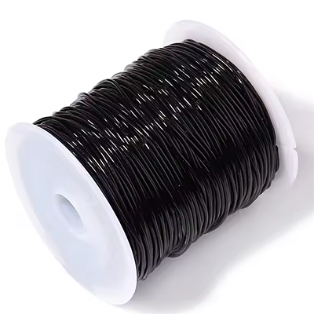
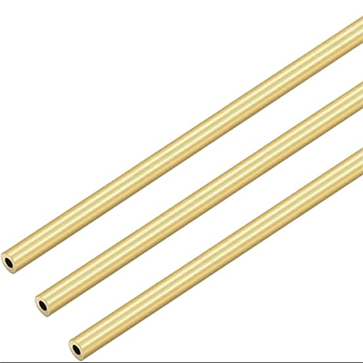
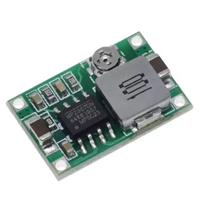
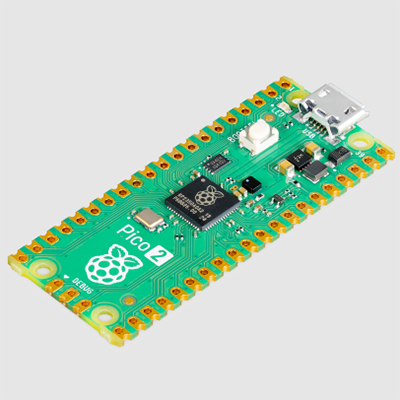
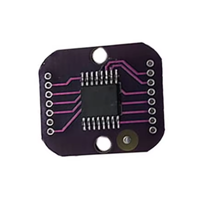
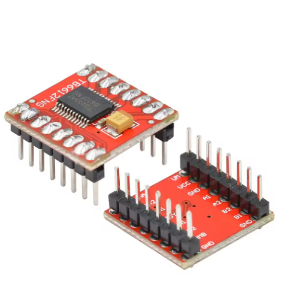
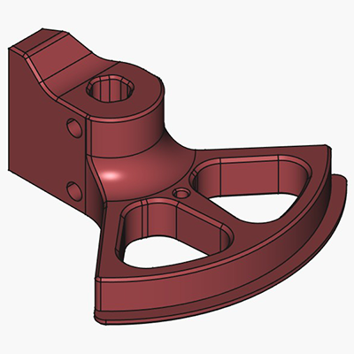
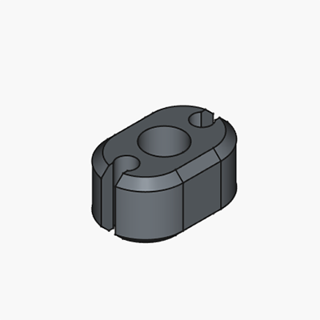
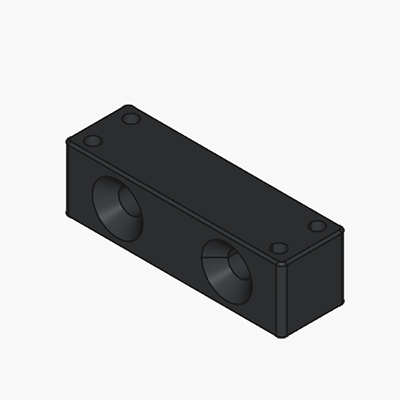
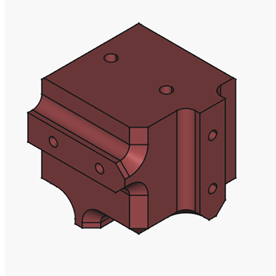

# Bill of Materials (BOM)

## Mechanics
| Name | Qty | Description | Comments | Suggested link | Image |
|------|-----|-------------|----------|----------------|-------|
| Steel ball | 12 | Ø1.25 mm (0.05") | Precision G10 or better. Can be sourced from small ball bearings | |
| PU stretch cord | 1 m | Ø1mm | e.g. "Stretch Magic" or "Magic String" | [Aliexpress](https://www.aliexpress.us/item/3256805953910514.html)| |
| Neodym Cylinder Magnet | 70 | Ø3mm h=4 mm | N42 Grade | [Ebay Link](https://www.ebay.de/itm/365333642187?var=635110190027)|
| Brass Pipe | 1 m | OD=Ø2mm ID=Ø1 mm |  | [Amazon](https://a.co/d/1pRFmtf)| |
| M2 Screw | 12 | M2×12 mm, Countersunk |  | |
| M3 Grub Screw | 6 | M3×4 |  | |

## Electronics
| Name | Qty | Description | Comments | Suggested link | Image |
|------|-----|-------------|----------|----------------|-------|
| DC-DC Step Down Module | 1 | 4.75–23 V Step-Down Buck Converter |  | [Aliexpress](https://www.aliexpress.us/item/3256806752772875.html)| |
| (1N5819) OR (PMEG4010) | 1 | Diode (through-hole or SMD) |  | |
| Raspberry Pi Pico 2 | 1 | Microcontroller board |  | | |
| MT6835 Magnetic Encoder Module | 3 | Magnetic encoder |  | [Aliexpress](https://www.aliexpress.us/item/3256808005140674.html)| |
| TB6612FNG Driver | 3 | |  | [Aliexpress](https://www.aliexpress.us/item/3256806060073976.html)| |
| 470 µF Electrolytic Capacitor | 3 | > 100 µF | anything > 100µF will work well | |
| 10 µF Ceramic Capacitor 0603 | 3 | Optional |  | |
| 4.7 k Resistor 0603 | 2 | Optional |  | |
| 2 Pin Power Header | 1 | 7.5 mm pitch |  | |
| 4 Pin Header | 4 | 2.5 mm pitch |  | |
| 8 Pin Header | 1 | 2.0 mm pitch |  | |
| NEMA 17 Stepper Motor | 3 | Body ≤ 38 mm | Body length <= 38mm | |

## 3D Printing
| Name | Qty | Description | Comments | Image |
|------|-----|-------------|----------|-------|
| Motor Horn | 3 |  | 0.4 mm+ nozzle may require post-processing | |
| RubberBandCollet | 6 |  | 0.4 mm+ nozzle may require post-processing | |
| BallJointMount | 6 |  | 0.4 mm+ nozzle may require post-processing | |
| Motor Mount | 3 |  |  | |
| End Effector | 1 |  |  | |
| Base Block | 1 |  |  | |
